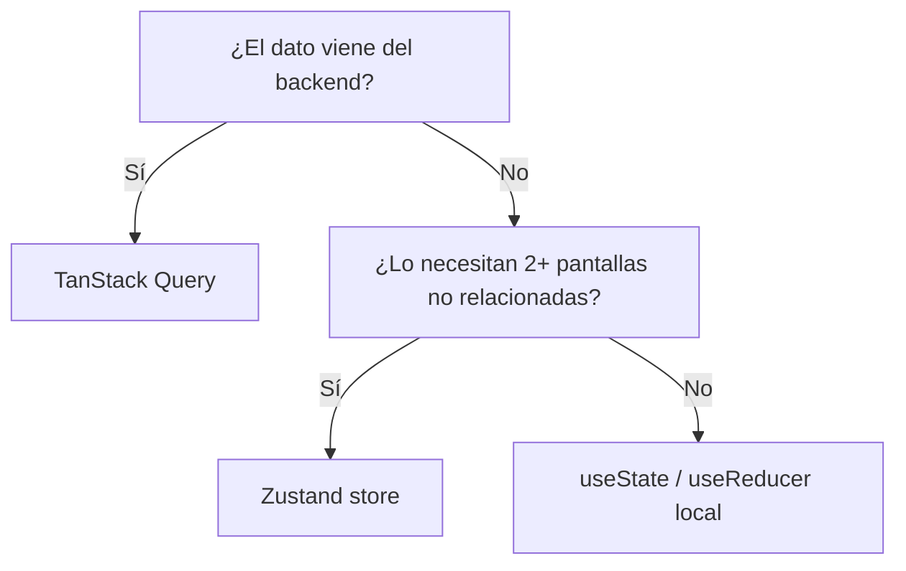
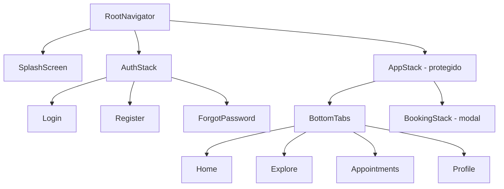
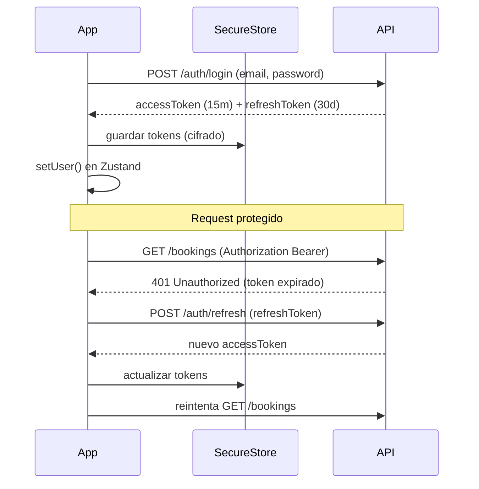
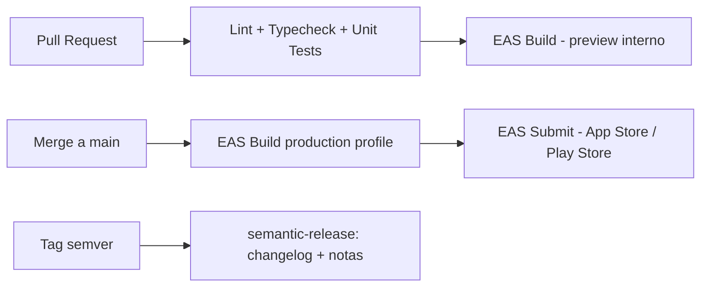

# Barber-core — Arquitectura Mobile (React Native)

> Documento base de arquitectura para el desarrollo de **Barber-core**, una app móvil profesional (iOS + Android) construida con React Native y TypeScript. Diseñado para escalar a múltiples equipos, mantenerse por años y soportar CI/CD desde el día 1.

**Principios rectores:** Clean Architecture por _features_, SOLID, tipado estricto de punta a punta, separación entre estado de servidor y estado de cliente, y "boring technology" — solo librerías maduras y con mantenimiento activo.

---

## 0. Resumen de decisiones clave

| Decisión                        | Elección                                             | Alternativa considerada           |
| ------------------------------- | ---------------------------------------------------- | --------------------------------- |
| Framework                       | **Expo (Prebuild / Dev Client, managed-ish)**        | React Native Community CLI (bare) |
| Lenguaje                        | **TypeScript 5.x strict**                            | —                                 |
| Package manager                 | **pnpm**                                             | yarn berry, npm                   |
| Estado servidor                 | **TanStack Query**                                   | RTK Query, SWR                    |
| Estado cliente                  | **Zustand**                                          | Redux Toolkit, Jotai, MobX        |
| Navegación                      | **React Navigation v7** (native-stack + bottom-tabs) | Expo Router                       |
| Estilos / Design System         | **NativeWind v4 + tokens propios**                   | Tamagui, Restyle                  |
| Persistencia KV                 | **MMKV**                                             | AsyncStorage                      |
| Persistencia relacional/offline | **Drizzle ORM sobre expo-sqlite**                    | WatermelonDB, Realm               |
| Secretos                        | **expo-secure-store / react-native-keychain**        | —                                 |
| Testing E2E                     | **Maestro**                                          | Detox                             |
| CI/CD                           | **GitHub Actions + EAS Build/Submit**                | Fastlane + GH Actions (bare)      |
| Error/Crash monitoring          | **Sentry**                                           | Bugsnag, Firebase Crashlytics     |

---

## 1. Stack tecnológico

### 1.1 Expo vs React Native CLI

| Criterio               | Expo (Prebuild/Dev Client)                                                                                | RN CLI (bare)                        |
| ---------------------- | --------------------------------------------------------------------------------------------------------- | ------------------------------------ |
| Velocidad de arranque  | Muy alta (EAS Build, OTA updates, módulos preconfigurados)                                                | Manual, más control desde el día 1   |
| Módulos nativos custom | Soportado vía **config plugins** + `expo prebuild` (Continuous Native Generation)                         | Nativo, sin capas intermedias        |
| CI/CD                  | EAS Build/Submit listo para usar                                                                          | Requiere Fastlane + runners propios  |
| OTA updates            | `expo-updates` integrado                                                                                  | Requiere CodePush u otra solución    |
| Ecosistema de módulos  | expo-camera, expo-notifications, expo-secure-store, expo-sqlite, etc. (mantenidos, testeados en conjunto) | Cada librería community por separado |
| Riesgo de "eyectar"    | Bajo — `prebuild` genera `ios/`/`android/` on-demand, no es una migración irreversible                    | N/A                                  |

**Decisión:** Expo con **Dev Client** (no Expo Go) y `prebuild`/CNG. Esto da lo mejor de ambos mundos: velocidad de desarrollo de Expo + capacidad de añadir cualquier módulo nativo (incluyendo los que requiere `react-native-keychain`, SSL pinning, etc.) sin bloquear el proyecto. Los directorios `ios/` y `android/` se tratan como **artefactos generados** (gitignored) salvo que se necesite un patch nativo puntual (`expo prebuild` + config plugin o `patch-package`).

### 1.2 Tabla de herramientas base

| Herramienta                                                                  | Uso                    | Justificación                                                                                                                               |
| ---------------------------------------------------------------------------- | ---------------------- | ------------------------------------------------------------------------------------------------------------------------------------------- |
| **React Native 0.76+** (New Architecture: Fabric + TurboModules por defecto) | Runtime                | Mejor performance, interop síncrona JS↔Nativo, es el default desde RN 0.76                                                                  |
| **TypeScript 5.x** (`strict`, `noUncheckedIndexedAccess`)                    | Tipado                 | Detecta errores en compilación, contratos de API, autocompletado en equipos grandes                                                         |
| **Node 22 LTS**                                                              | Tooling                | Versión LTS activa, requerida por Metro/Expo SDK recientes                                                                                  |
| **pnpm**                                                                     | Package manager        | Instalación por hardlinks (rápido, ahorra disco), `pnpm-lock.yaml` determinista, mejor manejo de monorepos si el proyecto crece a Turborepo |
| **Hermes**                                                                   | Motor JS               | Motor por defecto de RN, bytecode precompilado (arranque más rápido, menor uso de memoria, dificulta ligeramente la ingeniería inversa)     |
| **Babel** (`babel-preset-expo`)                                              | Transpilación          | Incluye soporte para `react-native-reanimated/plugin` (debe ir último), path aliases vía `babel-plugin-module-resolver`                     |
| **Metro**                                                                    | Bundler                | Bundler oficial RN; configurar `resolver.sourceExts`/SVG transformer y soporte monorepo si aplica                                           |
| **ESLint** (`eslint-config-expo` + `@typescript-eslint`)                     | Linting                | Reglas específicas de RN (hooks, no-inline-styles opcional), flat config                                                                    |
| **Prettier**                                                                 | Formato                | Formato consistente, integrado con ESLint vía `eslint-config-prettier` (evita conflictos de reglas)                                         |
| **Husky**                                                                    | Git hooks              | `pre-commit` (lint-staged) y `commit-msg` (commitlint)                                                                                      |
| **lint-staged**                                                              | Lint incremental       | Solo lintea/formatea archivos staged, hooks rápidos                                                                                         |
| **commitlint** + **Conventional Commits**                                    | Estándar de commits    | Habilita changelog automático y versionado semántico (semantic-release)                                                                     |
| **EditorConfig**                                                             | Consistencia de editor | Indentación/EOL uniformes entre IDEs                                                                                                        |

### 1.3 Ejemplo de configuración Babel

```js
// babel.config.js
module.exports = function (api) {
  api.cache(true);
  return {
    presets: ['babel-preset-expo'],
    plugins: [
      [
        'module-resolver',
        {
          root: ['./src'],
          alias: {
            '@bootstrap': './src/bootstrap',
            '@components': './src/components',
            '@features': './src/features',
            '@hooks': './src/hooks',
            '@services': './src/services',
            '@store': './src/store',
            '@theme': './src/theme',
            '@utils': './src/utils',
            '@types': './src/types',
          },
        },
      ],
      // reanimated plugin SIEMPRE debe ser el último
      'react-native-reanimated/plugin',
    ],
  };
};
```

---

## 2. Arquitectura del proyecto (estructura de carpetas)

Organización **por capas + por features** ("feature-first" dentro de una capa de aplicación clara). Cada `feature` es un módulo casi autocontenido (screaming architecture: al ver `src/features/`, se entiende de qué trata la app).

> **Nota de nomenclatura:** la carpeta de entry point se llama `bootstrap/`, no `app/`. Expo CLI/Metro tratan cualquier directorio llamado `app` (en la raíz o en `src/`) como root heurístico de **Expo Router** (file-based routing), incluso sin `expo-router` instalado. Como esta arquitectura usa React Navigation de forma explícita (sección 5), se evita ese nombre para no generar falsos positivos ni confundir a futuros colaboradores.

```
src/
├── bootstrap/      # Entry point, providers raíz, bootstrapping
├── navigation/      # Navegadores, linking config, guards
├── features/        # Módulos de dominio (auth, booking, barbers, profile...)
├── screens/         # Solo si hay pantallas que NO pertenecen a un feature concreto
├── components/       # Componentes de UI reutilizables, agnósticos de dominio
├── hooks/           # Hooks compartidos (no ligados a un feature)
├── services/        # Integraciones externas (analytics, push, storage, permissions)
├── api/             # Cliente HTTP, endpoints, tipado de contratos
├── store/           # Stores globales de Zustand
├── theme/           # Design tokens, ThemeProvider, dark/light
├── providers/        # Composición de Context/QueryClient/ThemeProvider/etc.
├── contexts/         # React Context puntuales (ej. AuthContext)
├── lib/              # Wrappers de librerías de terceros (config centralizada)
├── localization/     # i18n, traducciones, formato de fecha/moneda
├── storage/          # MMKV/SecureStore/SQLite — acceso a persistencia
├── permissions/       # Solicitud y estado de permisos nativos
├── analytics/         # Tracking de eventos, wrapper de analytics
├── notifications/      # Push notifications, local notifications
├── utils/            # Funciones puras, helpers
├── constants/          # Constantes globales (no confundir con config de ambiente)
├── types/             # Tipos/Interfaces compartidos globalmente
├── config/            # Config por ambiente, feature flags
└── assets/            # Imágenes, fuentes, lottie, íconos

__tests__/            # (o co-ubicado *.test.ts junto a cada módulo)
e2e/                  # Tests Maestro/Detox
```

### 2.1 Responsabilidad de cada carpeta

| Carpeta               | Responsabilidad                                                                                   | Reglas de dependencia                                                                       |
| --------------------- | ------------------------------------------------------------------------------------------------- | ------------------------------------------------------------------------------------------- |
| `bootstrap/`          | `App.tsx`, `index.ts`, composición de providers, splash/bootstrap, error boundary raíz            | Puede importar de cualquier capa                                                            |
| `navigation/`         | Stacks, tabs, linking config, `RootParamList` tipado, `AuthGuard`                                 | Importa `features/*/screens`, nunca al revés                                                |
| `features/<feature>/` | `screens/`, `components/`, `hooks/`, `api/`, `store/`, `types.ts` propios del dominio             | No debe importar de otro `feature` directamente (comunicación vía `store` global o eventos) |
| `screens/`            | Pantallas transversales (Splash, NotFound, Maintenance)                                           | —                                                                                           |
| `components/`         | Componentes "tontos" reutilizables (Button, Card, Input)                                          | No conoce features ni API                                                                   |
| `hooks/`              | Hooks genéricos (`useDebounce`, `useAppState`)                                                    | No conoce features                                                                          |
| `services/`           | Wrappers de SDKs nativos/externos (push, deep link, permisos)                                     | Consumido por `features` y `providers`                                                      |
| `api/`                | Instancia Axios, interceptores, definición de endpoints y DTOs                                    | Es la única capa que conoce HTTP                                                            |
| `store/`              | Stores Zustand _globales_ (sesión, tema, feature flags)                                           | Los stores locales de un feature viven en `features/<feature>/store`                        |
| `theme/`              | Tokens (color, spacing, typography), `ThemeProvider`                                              | —                                                                                           |
| `providers/`          | Composición: `QueryClientProvider`, `ThemeProvider`, `SafeAreaProvider`, `GestureHandlerRootView` | —                                                                                           |
| `contexts/`           | Context API puntual cuando Zustand es excesivo (ej. contexto de un wizard)                        | —                                                                                           |
| `lib/`                | Configuración centralizada de librerías (`dayjs`, `zod`, `sentry.ts`)                             | —                                                                                           |
| `localization/`       | i18next config, archivos de traducción `en.json`/`es.json`                                        | —                                                                                           |
| `storage/`            | Adaptadores MMKV/SecureStore/SQLite con interfaz única                                            | —                                                                                           |
| `permissions/`        | Helpers de `expo-camera`, `expo-location`, estado y solicitud                                     | —                                                                                           |
| `analytics/`          | Wrapper único (`track(event, props)`) que delega al SDK real                                      | —                                                                                           |
| `notifications/`      | Registro de push token, manejo de listeners, notificaciones locales                               | —                                                                                           |
| `utils/`              | Funciones puras sin dependencias de React                                                         | —                                                                                           |
| `constants/`          | Enums, regex, límites de negocio                                                                  | —                                                                                           |
| `types/`              | Tipos compartidos (`ApiResponse<T>`, `Nullable<T>`)                                               | —                                                                                           |
| `config/`             | `env.ts`, feature flags, `app.config.ts`                                                          | —                                                                                           |

**Regla de oro:** las dependencias fluyen `app → navigation → features → (components, hooks, services, api, store, theme, lib)`. Nunca al revés. Esto es lo que permite testear y extraer un `feature` sin arrastrar toda la app.

---

## 3. Gestión de estado

| Opción            | Cuándo usarla                                                                                         | Veredicto para Barber-core                                                                                                         |
| ----------------- | ----------------------------------------------------------------------------------------------------- | ---------------------------------------------------------------------------------------------------------------------------------- |
| **Zustand**       | Estado global de cliente: sesión, tema, filtros de UI persistentes, carrito de reserva en progreso    | ✅ Elegido — API mínima, sin boilerplate, selectors granulares evitan renders innecesarios, fácil de testear (es solo una función) |
| **Redux Toolkit** | Equipos grandes que ya requieren time-travel debugging, middlewares complejos, normalización estricta | Solo si el equipo/legacy ya lo exige. Más ceremonia de la que Barber-core necesita hoy                                             |
| **MobX**          | Apps con estado muy reactivo/mutable (ej. editores en tiempo real)                                    | No aplica al dominio (reservas, catálogo, perfil)                                                                                  |
| **Jotai**         | Estado atómico muy granular, ideal para formularios complejos                                         | Válido como complemento en un feature puntual, no como estándar global                                                             |
| **Context API**   | Estado de bajo cambio, alcance acotado (tema de un wizard, un modal)                                  | Usar solo para casos locales — **no** para estado que cambia con frecuencia (re-renderiza todo el árbol)                           |

### 3.1 Regla de decisión: ¿estado local, global de cliente, o de servidor?



- **Estado de servidor** (listado de barberos, disponibilidad, perfil del usuario): siempre **TanStack Query**. Nunca se copia a Zustand — Query ya es la fuente de verdad con cache, invalidación y sincronización.
- **Estado de cliente global**: sesión activa, tema, idioma, flags de onboarding → **Zustand**, con `persist` middleware sobre MMKV cuando deba sobrevivir a reinicios.
- **Estado local**: inputs de formulario, estado de un modal, animaciones → `useState`/`useReducer` dentro del componente o del feature.

### 3.2 Ejemplo de store Zustand con persistencia

```ts
// src/store/useSessionStore.ts
import { create } from 'zustand';
import { persist, createJSONStorage } from 'zustand/middleware';
import { mmkvStorage } from '@storage/mmkv';

interface SessionState {
  user: User | null;
  isAuthenticated: boolean;
  setUser: (user: User | null) => void;
  logout: () => void;
}

export const useSessionStore = create<SessionState>()(
  persist(
    (set) => ({
      user: null,
      isAuthenticated: false,
      setUser: (user) => set({ user, isAuthenticated: !!user }),
      logout: () => set({ user: null, isAuthenticated: false }),
    }),
    {
      name: 'session-storage',
      storage: createJSONStorage(() => mmkvStorage),
      partialize: (state) => ({ user: state.user }), // nunca persistir tokens aquí
    },
  ),
);
```

> Los **tokens** (access/refresh) **no** se guardan en Zustand/MMKV en texto plano: van a `expo-secure-store`/Keychain (ver sección 10).

---

## 4. Comunicación con APIs

### 4.1 Estructura de carpetas

```
src/api/
├── client.ts            # Instancia Axios base + interceptores
├── queryClient.ts        # Instancia de QueryClient (TanStack)
├── endpoints/
│   ├── auth.api.ts
│   ├── barbers.api.ts
│   └── bookings.api.ts
├── schemas/               # Zod schemas (validación runtime de respuestas)
│   ├── auth.schema.ts
│   └── booking.schema.ts
├── types/                 # Tipos generados/derivados de los schemas
└── errors/
    └── ApiError.ts
```

### 4.2 Cliente Axios con interceptores, refresh token y reintentos

```ts
// src/api/client.ts
import axios, { AxiosError } from 'axios';
import { getAccessToken, getRefreshToken, setTokens, clearTokens } from '@storage/secure';
import { ENV } from '@config/env';

export const apiClient = axios.create({
  baseURL: ENV.API_URL,
  timeout: 15_000,
});

apiClient.interceptors.request.use(async (config) => {
  const token = await getAccessToken();
  if (token) config.headers.Authorization = `Bearer ${token}`;
  return config;
});

let refreshPromise: Promise<string> | null = null;

apiClient.interceptors.response.use(
  (response) => response,
  async (error: AxiosError) => {
    const original = error.config as any;

    if (error.response?.status === 401 && !original._retry) {
      original._retry = true;
      try {
        // Coalesce concurrent refresh calls en un único request
        refreshPromise ??= refreshAccessToken();
        const newToken = await refreshPromise;
        refreshPromise = null;
        original.headers.Authorization = `Bearer ${newToken}`;
        return apiClient(original);
      } catch (refreshError) {
        await clearTokens();
        // emitir evento -> AuthStore.logout() -> navega a AuthStack
        eventBus.emit('session:expired');
        return Promise.reject(refreshError);
      }
    }

    return Promise.reject(normalizeApiError(error));
  },
);

async function refreshAccessToken(): Promise<string> {
  const refreshToken = await getRefreshToken();
  const { data } = await axios.post(`${ENV.API_URL}/auth/refresh`, { refreshToken });
  await setTokens(data.accessToken, data.refreshToken);
  return data.accessToken;
}
```

- **Cancelación de requests:** TanStack Query cancela automáticamente vía `AbortController` al desmontar/reintentar; para llamadas manuales fuera de Query se pasa `signal` explícito.
- **Timeout:** 15s por defecto, configurable por endpoint según criticidad (ej. subida de imágenes más alto).
- **Reintentos:** delegados a TanStack Query (`retry: 2`, backoff exponencial) solo para GET idempotentes; mutaciones **no** reintentan automáticamente (evita duplicar reservas/pagos).
- **Manejo offline:** `onlineManager` de TanStack Query + `@react-native-community/netinfo`; mutaciones críticas usan `queryClient.setMutationDefaults` + `persistQueryClient` (AsyncStorage/MMKV) para reintentar al reconectar.

### 4.3 TanStack Query — capa de datos tipada

```ts
// src/features/barbers/api/useBarbers.ts
import { useQuery } from '@tanstack/react-query';
import { apiClient } from '@api/client';
import { barberListSchema, type Barber } from '@api/schemas/barber.schema';

async function fetchBarbers(): Promise<Barber[]> {
  const { data } = await apiClient.get('/barbers');
  return barberListSchema.parse(data); // valida en runtime, no solo en compile-time
}

export function useBarbers() {
  return useQuery({
    queryKey: ['barbers'],
    queryFn: fetchBarbers,
    staleTime: 5 * 60 * 1000,
  });
}
```

**Invalidaciones:** convención de `queryKey` jerárquica (`['barbers']`, `['barbers', id]`, `['barbers', id, 'availability']`) para invalidar por prefijo tras cada mutación (`queryClient.invalidateQueries({ queryKey: ['barbers'] })`).

**Tipado de contratos:** Zod como single source of truth — el `schema` genera el tipo (`z.infer<typeof schema>`), evitando divergencia entre validación runtime y tipos estáticos. Si el backend expone OpenAPI, evaluar `openapi-typescript` para generar tipos base y usar Zod solo en los boundaries críticos.

---

## 5. Navegación

React Navigation v7 (`native-stack` + `bottom-tabs`), 100% tipada.



### 5.1 Tipado y guard de autenticación

```ts
// src/navigation/types.ts
export type RootStackParamList = {
  Splash: undefined;
  Auth: NavigatorScreenParams<AuthStackParamList>;
  App: NavigatorScreenParams<AppTabParamList>;
};

export type AuthStackParamList = {
  Login: undefined;
  Register: undefined;
  ForgotPassword: { email?: string };
};

declare global {
  namespace ReactNavigation {
    interface RootParamList extends RootStackParamList {}
  }
}
```

```tsx
// src/navigation/RootNavigator.tsx
export function RootNavigator() {
  const { isAuthenticated, isBootstrapping } = useSessionStore();

  if (isBootstrapping) return <SplashScreen />;

  return (
    <NavigationContainer linking={linkingConfig} theme={navigationTheme}>
      <Stack.Navigator screenOptions={{ headerShown: false }}>
        {isAuthenticated ? (
          <Stack.Screen name="App" component={AppTabs} />
        ) : (
          <Stack.Screen name="Auth" component={AuthStack} />
        )}
      </Stack.Navigator>
    </NavigationContainer>
  );
}
```

Este patrón (ramificar el árbol de navegación según sesión, en vez de un `if` dentro de cada pantalla) es el guard recomendado por React Navigation: **desmonta** el stack no autorizado, evitando back-navigation hacia pantallas protegidas.

### 5.2 Deep Linking / Universal Links

```ts
// src/navigation/linking.ts
export const linkingConfig: LinkingOptions<RootStackParamList> = {
  prefixes: ['barbercore://', 'https://barbercore.app'],
  config: {
    screens: {
      App: {
        screens: {
          Appointments: 'appointments/:id?',
        },
      },
      Auth: { screens: { Login: 'login' } },
    },
  },
};
```

- **iOS:** Associated Domains (`applinks:barbercore.app`) + archivo `apple-app-site-association` en el backend.
- **Android:** `intentFilters` con `autoVerify: true` en `app.json`/config plugin + `assetlinks.json`.
- **Lazy loading:** pantallas pesadas (ej. mapa, editor de imagen) via `React.lazy` + `Suspense`, o separadas en un stack que solo se monta al navegar (React Navigation ya desmonta stacks no activos).

---

## 6. Manejo de configuración por ambiente

| Ambiente    | Bundle ID / Package      | API URL                      | Uso                                                |
| ----------- | ------------------------ | ---------------------------- | -------------------------------------------------- |
| Development | `app.barbercore.dev`     | `api-dev.barbercore.app`     | Dev diario, Dev Client con hot reload              |
| QA          | `app.barbercore.qa`      | `api-qa.barbercore.app`      | Builds para QA interno (EAS internal distribution) |
| Staging     | `app.barbercore.staging` | `api-staging.barbercore.app` | Pre-producción, réplica de prod                    |
| Production  | `app.barbercore`         | `api.barbercore.app`         | Store (App Store / Play Store)                     |

- **`app.config.ts`** dinámico (en vez de `app.json` estático) que lee `process.env.APP_ENV` y retorna `name`, `bundleIdentifier`, `icon`, `extra` distintos por ambiente.
- **`.env.development` / `.env.qa` / `.env.staging` / `.env.production`** cargados con `react-native-dotenv` o `expo-env` + `EAS Secrets` para valores sensibles en CI (nunca committear `.env.production` con secretos reales).
- Acceso tipado centralizado:

```ts
// src/config/env.ts
import { z } from 'zod';
import Constants from 'expo-constants';

const envSchema = z.object({
  APP_ENV: z.enum(['development', 'qa', 'staging', 'production']),
  API_URL: z.string().url(),
  SENTRY_DSN: z.string().optional(),
});

export const ENV = envSchema.parse(Constants.expoConfig?.extra);
```

Fallar rápido (`parse` lanza en boot si falta una variable) es preferible a un `undefined` silencioso que rompe en producción.

- **EAS Build profiles** (`eas.json`) espejan estos 4 ambientes con sus propias variables y credenciales de firma.

---

## 7. Persistencia local

| Storage                                       | Tipo de dato                                                                                | Por qué                                                                                                                  |
| --------------------------------------------- | ------------------------------------------------------------------------------------------- | ------------------------------------------------------------------------------------------------------------------------ |
| **MMKV**                                      | Preferencias de UI, cache ligera, estado de Zustand persistido, flags de onboarding         | Sync, ~30x más rápido que AsyncStorage, respaldado en C++ (JSI)                                                          |
| **AsyncStorage**                              | Solo si una librería de terceros lo exige como dependencia obligatoria                      | Evitar como elección primaria — API async y más lenta                                                                    |
| **expo-secure-store / react-native-keychain** | Tokens (access/refresh), credenciales biométricas, cualquier secreto                        | Cifrado por el Keychain (iOS) / Keystore (Android), respaldado por hardware cuando el device lo soporta                  |
| **SQLite (Drizzle ORM / expo-sqlite)**        | Datos relacionales, catálogo de servicios offline, historial de citas para uso sin conexión | Consultas relacionales reales, soporta migraciones versionadas, mejor que "objetos grandes en KV" para listas que crecen |

Regla práctica: si el dato es un **secreto** → Keychain/SecureStore. Si es **clave-valor simple y no sensible** → MMKV. Si es **relacional o requiere consultas/filtrado offline** → SQLite.

---

## 8. Diseño y UI

### 8.1 Comparación de librerías de estilos

| Librería              | Ventaja                                                                                          | Desventaja                                                           |
| --------------------- | ------------------------------------------------------------------------------------------------ | -------------------------------------------------------------------- |
| **NativeWind v4**     | Sintaxis Tailwind (familiar, alta velocidad de equipo), compila a StyleSheet nativo              | Requiere disciplina para no romper la consistencia con clases libres |
| **Tamagui**           | Compilador que optimiza estilos y animaciones en build time, mejor rendimiento en listas pesadas | Curva de aprendizaje mayor, ecosistema más chico                     |
| **Restyle (Shopify)** | Tipado fuerte de tokens, muy explícito                                                           | Más verboso, menos velocidad de desarrollo                           |

**Decisión:** **NativeWind v4** sobre un set de **primitivos propios** (`Box`, `Text`, `Button`, `Card`) que envuelven `className`, para no acoplar toda la app a clases de Tailwind desperdigadas y mantener un Design System real.

### 8.2 Design tokens y ThemeProvider

```
src/theme/
├── tokens/
│   ├── colors.ts
│   ├── spacing.ts
│   ├── typography.ts
│   └── radii.ts
├── ThemeProvider.tsx
└── useTheme.ts
```

```ts
// src/theme/tokens/colors.ts
export const colors = {
  light: {
    bg: '#FFFFFF',
    text: '#0B0B0C',
    primary: '#111827',
    accent: '#D4A657', // acento "barbería"
    border: '#E5E7EB',
  },
  dark: {
    bg: '#0B0B0C',
    text: '#F5F5F5',
    primary: '#F5F5F5',
    accent: '#D4A657',
    border: '#27272A',
  },
} as const;
```

`ThemeProvider` lee `useColorScheme()` de RN + preferencia guardada en Zustand/MMKV (permite forzar claro/oscuro manualmente), y expone los tokens vía Context + hook `useTheme()`. Los componentes reutilizables (`components/`) consumen **solo tokens**, nunca colores hardcodeados.

---

## 9. Internacionalización

- **`i18next` + `react-i18next`** + `expo-localization` (detección de locale del dispositivo).
- Estructura:

```
src/localization/
├── i18n.ts
├── locales/
│   ├── es/common.json
│   ├── es/booking.json
│   ├── en/common.json
│   └── en/booking.json
```

- Namespaces por feature (`booking`, `auth`, `common`) para evitar un único archivo gigante y permitir _lazy loading_ de traducciones si la app crece a muchos idiomas.
- Formateo de fecha/moneda con `dayjs` (locale plugin) — **no** `Intl` puro en Hermes sin polyfills si se soportan RN < 0.74 (a partir de 0.74/Hermes moderno, `Intl` ya viene completo, pero fijar esto como chequeo en el roadmap).

---

## 10. Manejo de autenticación



- **Login/Logout:** flujo estándar, `logout()` limpia SecureStore + Zustand + cache de TanStack Query (`queryClient.clear()`) para no dejar datos de un usuario visibles para el siguiente.
- **Persistencia de sesión:** al bootear la app, se lee el `refreshToken` de SecureStore; si existe y es válido, se refresca el `accessToken` antes de mostrar el `AppStack` (pantalla de Splash controla este estado vía `isBootstrapping`).
- **Protección de rutas:** ver sección 5.1 (ramificación del navigator, no `if` por pantalla).
- **Biometría (Face ID / Touch ID / Fingerprint):** `expo-local-authentication`. Patrón recomendado: la biometría **no reemplaza** el login, sino que desbloquea el acceso a un `refreshToken` ya guardado en SecureStore (flag `requireBiometricAuth` guardado junto al token). Nunca usar biometría como único factor si el backend no lo soporta como tal.

```ts
// src/features/auth/hooks/useBiometricUnlock.ts
import * as LocalAuthentication from 'expo-local-authentication';

export async function unlockWithBiometrics() {
  const hasHardware = await LocalAuthentication.hasHardwareAsync();
  const isEnrolled = await LocalAuthentication.isEnrolledAsync();
  if (!hasHardware || !isEnrolled) return { success: false, reason: 'unavailable' };

  const result = await LocalAuthentication.authenticateAsync({
    promptMessage: 'Desbloquear Barber-core',
    fallbackLabel: 'Usar contraseña',
  });
  return { success: result.success };
}
```

---

## 11. Manejo de errores

| Capa                             | Herramienta                                                            | Propósito                                                                              |
| -------------------------------- | ---------------------------------------------------------------------- | -------------------------------------------------------------------------------------- |
| Render tree                      | `react-error-boundary` (Error Boundary raíz + por sección crítica)     | Evita pantalla en blanco total, permite "retry" localizado                             |
| Excepciones JS/nativas           | **Sentry** (`@sentry/react-native`)                                    | Crash reporting, breadcrumbs, source maps automáticos                                  |
| Errores de red                   | `ApiError` normalizado en `api/errors/ApiError.ts`                     | Mensajes consistentes, códigos mapeados a UI (ej. `NETWORK_ERROR`, `VALIDATION_ERROR`) |
| Errores no capturados / promesas | `ErrorUtils.setGlobalHandler` + `Promise` rejection tracking de Sentry | Último recurso antes de crash total                                                    |

```tsx
// src/bootstrap/App.tsx (fragmento)
<ErrorBoundary FallbackComponent={GlobalErrorFallback} onError={Sentry.captureException}>
  <RootNavigator />
</ErrorBoundary>
```

Cada `feature` puede envolver secciones críticas (ej. el flujo de pago) en su propio `ErrorBoundary` con un fallback contextual, en vez de depender solo del boundary global.

---

## 12. Testing

| Tipo            | Herramienta                                | Alcance                                                                               |
| --------------- | ------------------------------------------ | ------------------------------------------------------------------------------------- |
| Unit            | **Jest** + `@testing-library/react-native` | Hooks, utils, stores, componentes aislados                                            |
| Integration     | Jest + RTL + MSW (`msw` o mocks de Axios)  | Flujo de un feature completo (ej. formulario de reserva) con API mockeada             |
| E2E             | **Maestro**                                | Flujos críticos reales sobre build de Dev Client/EAS (login → reserva → confirmación) |
| Contract/tipado | `tsc --noEmit` en CI                       | Rompe el build ante cualquier `any` implícito o contrato roto                         |

```
src/features/booking/
├── __tests__/
│   ├── useBookingForm.test.ts
│   └── BookingScreen.test.tsx
e2e/
├── flows/
│   ├── login.yaml
│   └── create-booking.yaml
```

**Por qué Maestro sobre Detox:** setup declarativo en YAML (sin recompilar la app en cada cambio de test), corre igual de bien contra un build de Expo Dev Client, y su integración con EAS Build/CI es más simple para equipos que ya usan Expo.

Cobertura recomendada como gate de CI: **≥70% en `utils/`, `hooks/`, `store/`**; los E2E cubren solo los flujos de negocio críticos (no todo, son costosos de mantener).

---

## 13. Optimización

- **Listas:** `FlashList` (Shopify) en vez de `FlatList` para listas largas (catálogo de barberos/servicios) — recycling de vistas, mejor performance a igual API.
- **Imágenes:** `expo-image` (cache en disco/memoria, decodificación en background, soporte de placeholders/blurhash) en vez de `Image` de RN.
- **Fuentes:** cargar con `expo-font` + `useFonts` y mantener splash screen visible (`expo-splash-screen`) hasta que carguen, para evitar FOUT.
- **Memoización:** `React.memo` en componentes de lista, `useCallback`/`useMemo` solo donde el profiler (Flipper/React DevTools) muestre un re-render costoso — no memoizar preventivamente todo (ruido y complejidad sin beneficio real).
- **Bundle size:** Hermes bytecode + `expo-atlas`/`source-map-explorer` para auditar peso; evitar librerías que dupliquen date-libs (usar solo `dayjs`), tree-shaking de iconos (import individual, no el paquete completo).
- **Code splitting / lazy loading:** `React.lazy` + `Suspense` para pantallas pesadas no críticas en el primer render (ej. editor de imagen de perfil).
- **New Architecture (Fabric + TurboModules):** activada por defecto — reduce el overhead del bridge, especialmente relevante para animaciones (`react-native-reanimated` v3+) y gestos (`react-native-gesture-handler`).

---

## 14. Seguridad

| Práctica                    | Herramienta / Enfoque                                                                                                                                           |
| --------------------------- | --------------------------------------------------------------------------------------------------------------------------------------------------------------- |
| Almacenamiento seguro       | `expo-secure-store` (iOS Keychain / Android Keystore) para tokens y secretos                                                                                    |
| Certificate pinning         | `react-native-ssl-pinning` o config nativa (`NSPinnedDomains` en iOS / Network Security Config en Android) contra la API de producción                          |
| Validación de certificados  | TLS estricto, sin `rejectUnauthorized: false` en ningún ambiente productivo                                                                                     |
| Ofuscación                  | Hermes bytecode (base) + ProGuard/R8 habilitado en release de Android; evaluar herramientas de ofuscación adicionales solo si el riesgo de negocio lo justifica |
| Protección de secretos      | Ningún secreto de backend en el bundle JS; `EAS Secrets`/GitHub Secrets para credenciales de CI; `.env*` con valores reales fuera de git                        |
| Detección de root/jailbreak | `jail-monkey` — usar para **degradar funcionalidad sensible** (ej. bloquear pagos), no para bloquear la app entera (falsos positivos existen)                   |
| Ingeniería inversa          | Deep linking y endpoints sensibles siempre validados server-side — nunca confiar en lógica de negocio solo del lado cliente                                     |

---

## 15. Accesibilidad

- Todo elemento interactivo con `accessibilityRole` y `accessibilityLabel` explícitos (no depender del texto visible cuando hay iconografía).
- Contraste de color validado contra WCAG AA en ambos temas (tokens de `theme/` auditados, no solo elegidos "a ojo").
- Tamaños táctiles mínimos 44x44pt (iOS HIG) / 48x48dp (Material) en los primitivos de `components/`.
- Soporte de `Dynamic Type`/escalado de fuente del sistema (evitar tamaños de fuente hardcodeados que no respeten `allowFontScaling`).
- Testear con **VoiceOver** (iOS) y **TalkBack** (Android) los flujos críticos (login, reserva, pago) antes de cada release mayor.
- `accessibilityLiveRegion`/`AccessibilityInfo.announceForAccessibility` para feedback asíncrono (ej. "Reserva confirmada").

---

## 16. Integración con servicios nativos

| Servicio           | Librería                                                               | Carpeta                                                          |
| ------------------ | ---------------------------------------------------------------------- | ---------------------------------------------------------------- |
| Push Notifications | `expo-notifications`                                                   | `src/notifications/`                                             |
| Cámara             | `expo-camera` / `expo-image-picker`                                    | `src/permissions/`, `src/features/profile/`                      |
| Galería            | `expo-image-picker`                                                    | idem                                                             |
| GPS                | `expo-location`                                                        | `src/permissions/`, `src/features/booking/` (barberías cercanas) |
| Bluetooth          | `react-native-ble-plx` (si se requiere hardware, ej. terminal de pago) | módulo aislado en `src/services/ble/`                            |
| NFC                | `react-native-nfc-manager`                                             | `src/services/nfc/`                                              |
| Compartir archivos | `expo-sharing`                                                         | `src/services/share/`                                            |
| Descargas/Uploads  | `expo-file-system` + `apiClient` (multipart)                           | `src/services/files/`                                            |

Todos exponen una **interfaz propia** en `services/` que envuelve el SDK (no se consume el SDK de terceros directamente desde un `feature`), para poder mockear en tests y cambiar de proveedor sin tocar la capa de negocio.

---

## 17. CI/CD



- **GitHub Actions:**
  - `ci.yml`: en cada PR → `pnpm install`, `eslint`, `tsc --noEmit`, `jest`, opcionalmente `maestro test` sobre un build de preview.
  - `build.yml`: en push a `main`/tags → `eas build --profile production --non-interactive`.
  - `submit.yml`: manual/aprobado → `eas submit`.
- **EAS Build/Submit** como estrategia principal (dado Expo); **Fastlane** queda como alternativa/complemento si en algún punto se necesita un pipeline 100% self-hosted o lógica de firma muy custom que EAS no cubra.
- **Firma de apps:** credenciales gestionadas por EAS (o `fastlane match` si se migra a self-hosted) — nunca committeadas al repo.
- **Versionado automático:** `semantic-release` a partir de Conventional Commits → bump de `app.config.ts` version/buildNumber + changelog + tag.
- **Distribución interna (QA):** EAS `internal` distribution (o TestFlight/Play Internal Testing) por cada merge a `develop`.

---

## 18. Dependencias principales

| Librería                                 | Propósito                       | Motivo de elección                                            | Alternativas                         | Madurez                                             |
| ---------------------------------------- | ------------------------------- | ------------------------------------------------------------- | ------------------------------------ | --------------------------------------------------- |
| `expo`                                   | Framework/toolchain             | CNG + EAS + módulos nativos mantenidos en conjunto            | RN CLI puro                          | Muy alta                                            |
| `typescript`                             | Tipado estático                 | Estándar de facto                                             | Flow                                 | Muy alta                                            |
| `zustand`                                | Estado global cliente           | Mínimo boilerplate, selectors eficientes                      | Redux Toolkit, Jotai                 | Alta                                                |
| `@tanstack/react-query`                  | Estado de servidor/cache        | Cache, invalidación, retries, offline out-of-the-box          | SWR, RTK Query                       | Muy alta                                            |
| `axios`                                  | Cliente HTTP                    | Interceptores maduros, amplia adopción                        | `ky`, `fetch` nativo                 | Muy alta                                            |
| `zod`                                    | Validación runtime              | Infiere tipos TS desde el schema (single source of truth)     | `yup`, `io-ts`                       | Alta                                                |
| `@react-navigation/native` (v7)          | Navegación                      | Estándar de la comunidad, tipado robusto, deep linking maduro | Expo Router                          | Muy alta                                            |
| `nativewind`                             | Estilos                         | Velocidad de equipo (Tailwind), compila a StyleSheet          | Tamagui, Restyle                     | Alta                                                |
| `react-native-mmkv`                      | Persistencia KV                 | Rendimiento, sync API                                         | AsyncStorage                         | Alta                                                |
| `drizzle-orm` + `expo-sqlite`            | Persistencia relacional/offline | ORM tipado, migraciones versionadas                           | WatermelonDB, Realm                  | Media-alta (Drizzle en RN es reciente pero estable) |
| `expo-secure-store`                      | Secretos                        | Cifrado por OS, API simple                                    | `react-native-keychain`              | Alta                                                |
| `react-native-reanimated`                | Animaciones                     | Corre en UI thread, estándar de facto                         | `Animated` core                      | Muy alta                                            |
| `react-native-gesture-handler`           | Gestos                          | Requerido por Reanimated/Navigation                           | —                                    | Muy alta                                            |
| `@sentry/react-native`                   | Crash/error reporting           | Source maps automáticos, breadcrumbs, performance tracing     | Bugsnag                              | Muy alta                                            |
| `i18next` / `react-i18next`              | Internacionalización            | Estándar de facto en JS                                       | `lingui`, `formatjs`                 | Muy alta                                            |
| `dayjs`                                  | Fechas                          | Ligero, API similar a Moment, plugins de locale               | `date-fns`, `luxon`                  | Muy alta                                            |
| `@shopify/flash-list`                    | Listas performantes             | Recycling real de vistas                                      | `FlatList`                           | Alta                                                |
| `expo-image`                             | Imágenes                        | Cache y decodificación optimizadas                            | `react-native-fast-image`            | Alta                                                |
| `jest` + `@testing-library/react-native` | Testing unit/integration        | Estándar de facto RN                                          | —                                    | Muy alta                                            |
| `maestro`                                | Testing E2E                     | Setup declarativo, rápido, buena integración CI               | Detox                                | Alta                                                |
| `jail-monkey`                            | Detección root/jailbreak        | Simple, mantenida                                             | `react-native-device-info` (parcial) | Media                                               |

---

## 19. Estructura final del proyecto

```
barber-core/
├── .github/
│   └── workflows/
│       ├── ci.yml
│       ├── build.yml
│       └── submit.yml
├── .husky/
│   ├── pre-commit
│   └── commit-msg
├── docs/
│   └── ARCHITECTURE.md
├── e2e/
│   └── flows/
│       ├── login.yaml
│       └── create-booking.yaml
├── src/
│   ├── bootstrap/
│   │   ├── App.tsx
│   │   └── index.ts
│   ├── analytics/
│   │   └── track.ts
│   ├── api/
│   │   ├── client.ts
│   │   ├── queryClient.ts
│   │   ├── endpoints/
│   │   ├── schemas/
│   │   └── errors/
│   ├── assets/
│   │   ├── fonts/
│   │   ├── images/
│   │   └── lottie/
│   ├── components/
│   │   ├── Button/
│   │   ├── Card/
│   │   └── Input/
│   ├── config/
│   │   ├── env.ts
│   │   └── featureFlags.ts
│   ├── constants/
│   ├── contexts/
│   ├── features/
│   │   ├── auth/
│   │   │   ├── screens/
│   │   │   ├── components/
│   │   │   ├── hooks/
│   │   │   ├── api/
│   │   │   ├── store/
│   │   │   └── types.ts
│   │   ├── barbers/
│   │   ├── booking/
│   │   └── profile/
│   ├── hooks/
│   ├── lib/
│   │   ├── dayjs.ts
│   │   └── sentry.ts
│   ├── localization/
│   │   ├── i18n.ts
│   │   └── locales/
│   ├── navigation/
│   │   ├── RootNavigator.tsx
│   │   ├── AuthStack.tsx
│   │   ├── AppTabs.tsx
│   │   ├── linking.ts
│   │   └── types.ts
│   ├── notifications/
│   ├── permissions/
│   ├── providers/
│   │   └── AppProviders.tsx
│   ├── services/
│   │   ├── ble/
│   │   ├── files/
│   │   └── share/
│   ├── store/
│   │   ├── useSessionStore.ts
│   │   └── useThemeStore.ts
│   ├── storage/
│   │   ├── mmkv.ts
│   │   ├── secure.ts
│   │   └── sqlite/
│   ├── theme/
│   │   ├── tokens/
│   │   ├── ThemeProvider.tsx
│   │   └── useTheme.ts
│   ├── types/
│   └── utils/
├── app.config.ts
├── babel.config.js
├── metro.config.js
├── eas.json
├── eslint.config.js
├── .prettierrc
├── .editorconfig
├── commitlint.config.js
├── tsconfig.json
├── package.json
└── pnpm-lock.yaml
```

---

## 20. Roadmap de implementación

1. **Bootstrap del repo:** Expo + TypeScript strict, pnpm, ESLint/Prettier, Husky/lint-staged/commitlint, EditorConfig.
2. **Config por ambiente:** `app.config.ts`, `.env.*`, `src/config/env.ts` con validación Zod.
3. **Theme + Design System base:** tokens, `ThemeProvider`, primitivos (`Button`, `Text`, `Card`, `Input`) con NativeWind.
4. **Navegación esqueleto:** `RootNavigator`, `AuthStack`, `AppTabs` (pantallas placeholder), linking config, tipado completo.
5. **Capa de API:** cliente Axios + interceptores + refresh token, `QueryClient`, `ApiError`, un endpoint real de prueba.
6. **Persistencia:** adaptadores MMKV/SecureStore, `useSessionStore` con persist.
7. **Autenticación end-to-end:** login/logout, bootstrap de sesión al abrir la app, guard de navegación.
8. **Feature piloto completo** (ej. `barbers` — listado + detalle) para validar el patrón feature-first de punta a punta (API → Query → UI → tests).
9. **Testing:** Jest + RTL configurado, primer test unit e integration, primer flujo Maestro (login).
10. **Error handling & monitoring:** Sentry, Error Boundaries, `ApiError` mapeado a UI.
11. **i18n:** i18next + namespaces `common`/`auth`, extracción de strings del feature piloto.
12. **CI:** GitHub Actions (`ci.yml`) con lint + typecheck + tests bloqueando merges.
13. **CD:** `eas.json` con 4 perfiles, `build.yml`/`submit.yml`, distribución interna QA.
14. **Feature de negocio siguiente** (`booking`) reutilizando todos los patrones ya establecidos.
15. **Hardening:** SSL pinning, `jail-monkey`, auditoría de accesibilidad, revisión de bundle size, biometría.
16. **Servicios nativos restantes** (push, cámara, GPS, share) según prioridad de producto.
17. **Roll-out gradual:** feature flags (`config/featureFlags.ts`) para activar funcionalidades nuevas sin bloquear release.

> A partir del paso 8, el resto del desarrollo de producto son iteraciones del mismo patrón (`feature-first` + Query + Zustand + tests), lo que hace que el costo marginal de cada nueva pantalla/feature sea bajo y predecible.
